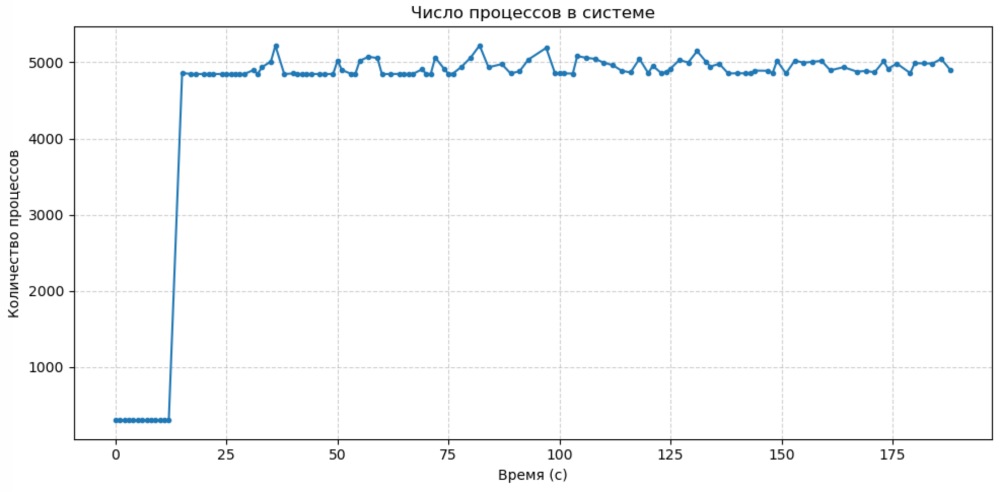

# Analysis — Fork Bomb on Linux

This is the write-up of what the measurements show when the
`:(){ :|: &};:` fork bomb runs on Ubuntu 24.04.3 LTS (2 CPU cores, 4 GB RAM,
inside a VM).

## The data

`monitor.sh` sampled the total process count (`ps -e`) once per second while
the bomb ran. `plot_procs.py` turned that log into the chart below.

The curve has three clear phases.

## Phase 1 — Baseline (~300 processes)

Before the bomb is launched the graph is a flat line at roughly 300. These are
the background processes a freshly booted Ubuntu desktop runs on its own —
system services, the desktop session, the terminal, and the monitor script
itself. This is the system's normal idle state and the reference point for
everything that follows.

## Phase 2 — Exponential spike

The moment the fork bomb starts, the curve rises almost vertically. This is
the exponential behaviour of the payload: every process forks two children,
each of those forks two more, and the count doubles continuously. Because each
generation is created so quickly, on a one-second sampling interval the rise
looks like a single near-vertical wall rather than a smooth curve.

In a matter of seconds the system goes from ~300 processes to several
thousand. This is the part of the attack that does the damage — not any single
process, but the sheer rate at which new ones are demanded.

## Phase 3 — Plateau and oscillation (~5000 processes)

The curve does not keep climbing to infinity. It flattens out around 5000 and
then wobbles up and down near that level for the rest of the run.

That plateau is the important result. It means the system hit a hard ceiling
and `fork()` started failing: new process creation returns the error
`EAGAIN` ("resource temporarily unavailable") because the resources needed for
another process — a process slot or memory — are simply not available.

The ceiling is a **dynamic equilibrium**, not a frozen number. While `fork()`
fails for new processes, some of the existing processes still exit and free
their slots, which immediately get filled by processes that were waiting to be
created. Creation and termination happen at roughly the same rate, so the
total hovers around 5000 and produces the characteristic jagged oscillation in
the graph.

A note on this particular run: an explicit `ulimit -u` (per-user process
limit) was **not** set beforehand, so the ceiling here came from general
resource exhaustion — primarily the inability to allocate more memory — rather
than from a configured process cap. Setting `ulimit -u` explicitly would put
the ceiling lower and make it predictable; that is the recommended way to run
this experiment.

## How the system behaved

While the bomb was at full strength the VM slowed down noticeably. The
interface lagged, and commands typed into the terminal ran with a visible
delay. There were short freezes.

But the operating system did **not** die. It stayed responsive enough to
remain controllable, and once the load was removed it gradually returned to a
normal state.

## Why Linux survived — the kernel defenses

Linux has built-in mechanisms that stop a fork bomb from being fatal:

- **Process limits (`ulimit -u` / `RLIMIT_NPROC`).** The kernel enforces a cap
  on how many processes a single user may own. Once that cap is reached,
  `fork()` simply fails with `EAGAIN` instead of letting the count grow without
  bound. This is what produces the flat plateau in the graph.
- **The OOM killer (Out-Of-Memory killer).** When memory pressure becomes
  severe, the kernel selects and terminates processes to reclaim memory and
  keep the system alive. This trims the process population whenever the bomb
  pushes memory use too high.

Together these defenses convert what could be a total crash into a bounded,
survivable load: the process count rises fast, gets capped, oscillates, and
the system recovers once the attack stops.

## Conclusion

A fork bomb has a strong, immediate impact on Linux — a steep rise in process
count, sharp performance degradation, and brief freezes. But on an isolated VM
with resource limits in place it causes **no irreversible damage**: the kernel's
process limits and OOM killer hold the growth at a ceiling, the system stays
manageable throughout, and it returns to normal after the load is removed.

The experiment is a clean demonstration of how Linux handles an extreme,
self-inflicted load while staying stable — and of why per-user process limits
(`ulimit -u`) are a simple, effective defense worth setting in advance.
